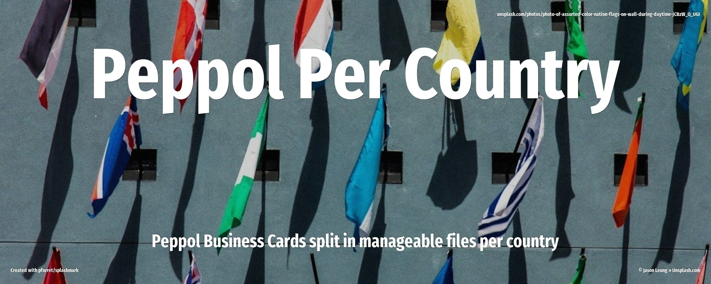

# Peppol Per Country

**Peppol Per Country** is a GitHub repository where the Peppol Business Cards export from [directory.peppol.eu](https://directory.peppol.eu/export/businesscards) (a single XML file of more than 2GB), is split into manageable XML files of about 2MB per country and registration month, and this is synced on a daily basis.

It allows for

* version control of the Peppol repository.
* subscribing to one specific country (cf [sparse checkout](sparse.md) )

## Core Technology

- [peppol_sync.py](https://peppoller.github.io/per_country/peppol_sync/)
- Python 3.x with `lxml` for XML processing
- [GitHub Actions](https://peppoller.github.io/per_country/github/) for daily automated sync
- [Project Documentation](https://peppoller.github.io/per_country/documentation/) : MkDocs with Material theme (using [pforret/mkdox](https://github.ciom/pforret/mkdox) )

## Sparse Checkout

You can 'subscribe' to only the .xml files **for 1 specific country** (so not the full 2+GB of extract files) , using [git sparse-checkout](https://peppoller.github.io/per_country/sparse/).

 [github.com/peppoller/per_country](https://github.com/peppoller/per_country)